<a href="https://jeevankatta.github.io/Jeevankatta/"></a>

<p align="center">
  <a href="https://jeevankatta.github.io/Jeevankatta/"></a>
  <a href="https://linkedin.com/in/jeevan-katta-7212b0220"></a>
  <a href="mailto:jeevankatta17@gmail.com"></a>
  <a href="https://jeevankatta.github.io/Jeevankatta/Katta_Jeevan_Resume.pdf"></a>
</p>

## 👋 About me

DevOps and Cloud Engineer with **2.6 years running production workloads for a US banking client** at Cognizant: CI/CD pipelines, AWS, Kubernetes, Terraform, monitoring and on-call. I also led the pilot that got GitHub Copilot and Amazon Q approved inside a regulated bank, by building a working system instead of a slide deck.

**Now:** building Kubernetes platforms from scratch, preparing for the **CKA**, and open to **DevOps, Cloud and Platform roles** in India or remote.

```yaml
name: Jeevan Katta
role: DevOps & Cloud Engineer
experience: 2.6 years · production banking workloads
location: Hyderabad, India · onsite or remote
certs: [AWS Certified Cloud Practitioner, CKA (in progress)]
status: open_to_work ✅
```

## 🚀 Open-source projects

| Project | What it shows |
|---|---|
| **[☸️ Kubernetes GitOps Platform](https://github.com/Jeevankatta/k8s-gitops-platform)**<br>`Terraform` `Helm` `ArgoCD` `Argo Rollouts` `Kyverno` `Prometheus` | 3-node cluster and 5 add-ons from modular Terraform with remote state locking. Helm chart with probes, HPA, PDB and least-privilege RBAC. Pull-based GitOps with ArgoCD, canary releases, 4 PromQL alert rules and 3 Kyverno policies. |
| **[🛡️ DevSecOps CI/CD Pipeline](https://github.com/Jeevankatta/devsecops-pipeline)**<br>`GitHub Actions` `Trivy` `SonarCloud` `OWASP DC` `gitleaks` | 7-job pipeline with 4 build-failing security gates and an ephemeral Kubernetes cluster for end-to-end tests. Image size cut ~60% with multi-stage builds, non-root read-only runtime, OIDC short-lived credentials. |
| **[🌐 This portfolio](https://jeevankatta.github.io/Jeevankatta/)**<br>`React` `Vite` `GitHub Actions` | Live pipeline console and an interactive terminal. Built and deployed by GitHub Actions on every push. |

## 💼 Experience

**Software Engineer, DevOps & Cloud** · Cognizant · Dec 2023 – Jun 2026 · Hyderabad
<sub>US banking client</sub>

- Built and ran CI/CD pipelines (Jenkins, GitHub Actions) for enterprise banking applications, from build to production deployment.
- Managed AWS infrastructure (EC2, VPC) and Kubernetes workloads, provisioned with Terraform.
- Operated ETL and batch jobs on Autosys / CA Workload Automation for the client's data warehouse, validating data with Oracle SQL.
- Monitored production with Dynatrace, CloudWatch and Splunk; resolved incidents through ServiceNow with CyberArk-managed privileged access.

<details>
<summary><b>Production work highlights</b> (click to expand)</summary>
<br>

- **AI Incident Playbook:** trained on historical incident data; on a new issue it produces SOP-style troubleshooting steps and routes the ticket to the owning team.
- **GenAI pilot:** built a Java Spring Boot bank management system as the live proof that won approval for GitHub Copilot and Amazon Q.
- **Java 8 → 17 migration:** modernised a legacy codebase, using AI assistants for deprecated APIs, syntax and dependency upgrades.
- **ETL failure guardrails:** shell scripts that catch extract/load failure conditions before they cause an outage.
- **Oracle → AWS migration:** moved the full Oracle SQL table estate to AWS.

</details>

## 🛠️ Tech stack


## 📜 Certifications

- ✅ AWS Certified Cloud Practitioner
- ⏳ Certified Kubernetes Administrator (CKA), in progress

---

<p align="center"><sub>Hyderabad, India · Open to DevOps and Cloud roles · <a href="https://jeevankatta.github.io/Jeevankatta/">jeevankatta.github.io/Jeevankatta</a></sub></p>
